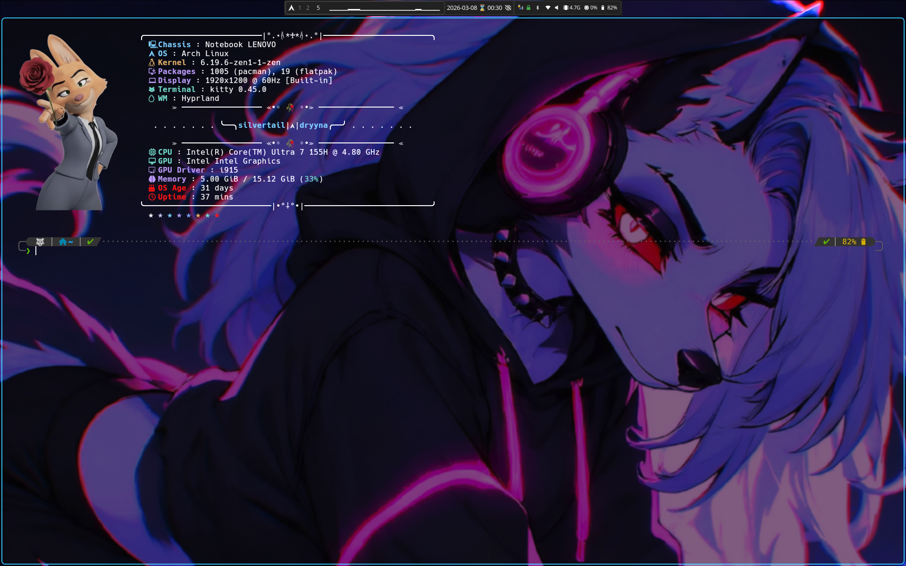
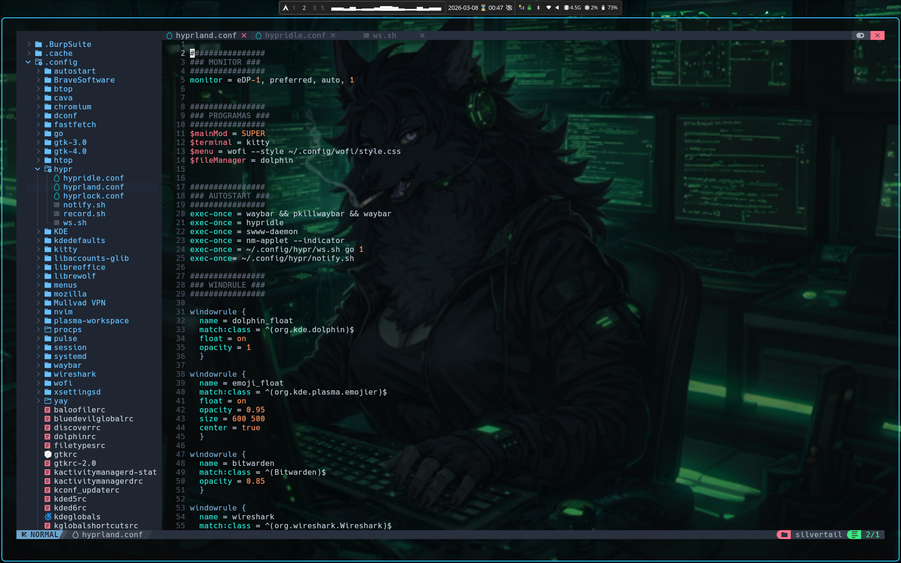
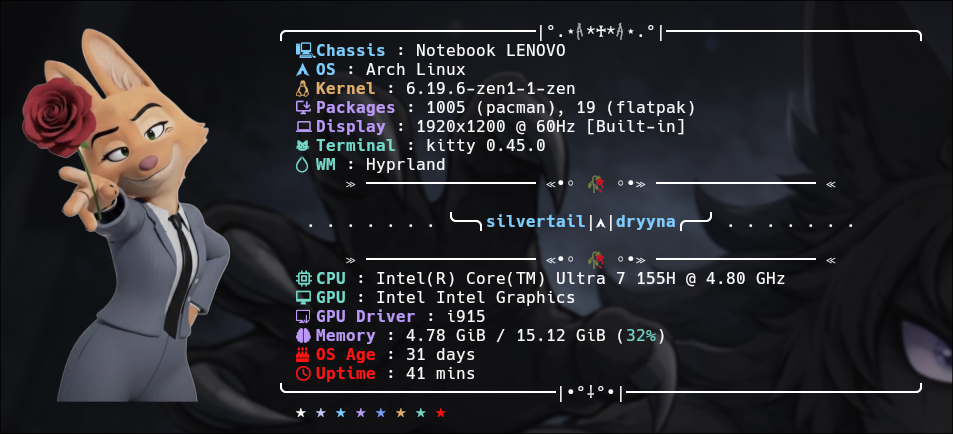

# arch_linux_dotfiles

## Stack && Dependencies
- WM: Hyprland
- Wallpaper: swww
- Lock: Hyprlock
- Screenshots: Hyprshot
- Bar: Waybar
- Launch: Wofi
- Notifications: SwayNC
- Fonts: Nerd Font
- Themes: Papirus
- Shell: zsh + PowerLevel 10 k
- Terminal: Kitty
- Fetch: Fastfetch
## NVChat config (personal)

- For no autocomplete:
in ~/.confg/nvim/lua/plugins/init.lua add init.lua
- For transparecy:
in ~/.config/nvim/init.lua add neovim_transparent.txt
## Credits
- Waybar config: https://github.com/HANCORE-linux/waybar-themes
## Zsh
- Instant Prompt is disabled to avoid conflicts with fastfetch.
- The `.zshrc` is configured so that **fastfetch** runs before the shell prompt initializes.
- This setup is specifically tuned to work with Powerlevel10k.- The Powerlevel10k initialization line in `.zshrc` is intentionally placed after fastfetch to ensure proper loading order.
- The default P10k instant prompt snippet is commented out to prevent startup warnings or rendering issues.
- The `.zshrc` is configured to send ponysay errors to /dev/null
## Fastfetch

- `fastfetch` is configured with custom styling and personal aesthetic preferences.
- Image rendering is enabled using `kitty` image protocol.
- Custom logo images are stored inside the fastfetch `profile directory`.
## Cool terminal apps:

* **Ponysay** — `sudo pacman -S ponysay`
* **Cowsay** — `sudo pacman -S cowsay`
* **Btop** — `sudo pacman -S btop`
* **Cava** — `sudo pacman -S cava`
* **Cmatrix** — `sudo pacman -S cmatrix`
* **Lolcat** — `sudo pacman -S lolcat`
* **Pipes.sh** — `yay -S pipes.sh`
* **Nyancat** — `sudo pacman -S nyancat`
* **Peaclock** — `yay -S peaclock`
* **AAlib** — `sudo pacman -S aalib`
* **Asciiquarium** — `sudo pacman -S asciiquarium`
* **sl** — `sudo pacman -S sl`
* **mapscii** — `npm install -g mapscii`
